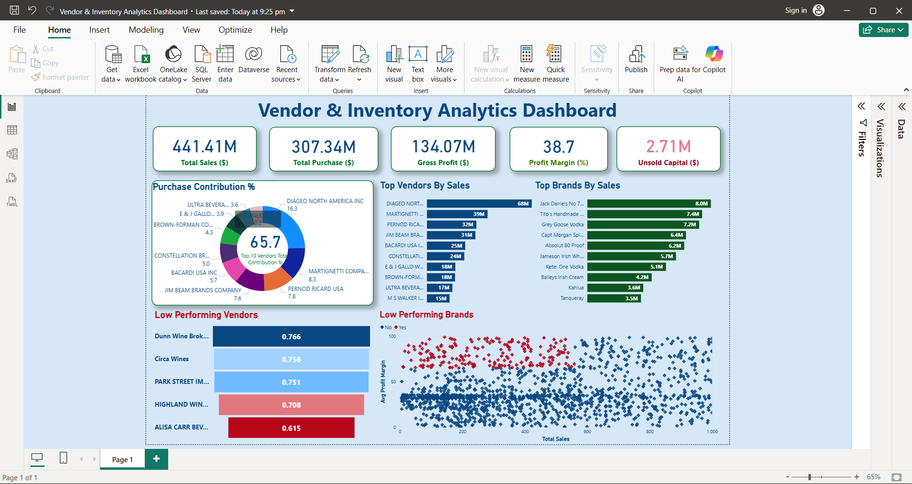

📊 Supply Chain Performance Dashboard

🚀 Project Overview

This project presents an end-to-end data analytics solution to evaluate vendor performance, inventory efficiency, and profitability. Using Python, SQL, and Power BI, it uncovers actionable insights that support data-driven decision-making in supply chain and retail operations.

🎯 Business Problem

In retail and wholesale industries, inefficient pricing, poor inventory turnover, and over-dependence on a few vendors can negatively impact profitability.

This project focuses on:

* Identifying underperforming vendors and brands
* Reducing unsold inventory and holding costs
* Optimizing pricing strategies
* Improving overall supply chain efficiency

🛠️ Tools & Technologies

* **Python** (Pandas, Matplotlib, Seaborn)
* **SQL** (Data extraction & transformation)
* **Power BI** (Interactive dashboard & visualization)
* **Excel** (Data preprocessing)

📊 Dashboard Features

* KPI Cards (Total Sales, Purchase, Profit, Profit Margin)
* Vendor Performance Analysis
* Brand-Level Insights
* Low Performing Vendors Identification
* Inventory & Profitability Analysis
* Purchase Contribution Breakdown

📈 Key Insights

* 📌 Top 10 vendors contribute approximately **65% of total purchases**, indicating vendor dependency
* 📌 Around **$2.71M unsold inventory** identified, impacting cash flow and storage costs
* 📌 Bulk purchasing reduces unit cost by nearly **72%**, improving cost efficiency
* 📌 Several brands show **high profit margins but low sales volume**, indicating pricing or marketing gaps
* 📌 Weak correlation between pricing and sales suggests external influencing factors

📊 Dashboard Preview

📂 Project Structure

├── supply_chain_dashboard.pbix        # Power BI Dashboard
├── vendor_sales_summary.csv           # Dataset
├── get_vendor_summary.py              # Python Analysis Script
├── dashboard.png                      # Dashboard Screenshot
└── README.md                          # Project Documentation

⚙️ Project Workflow

1. Data Collection & Cleaning (Python, Excel)
2. Data Transformation using SQL
3. Exploratory Data Analysis (EDA)
4. Data Visualization using Power BI
5. Insight Generation & Business Recommendations

💡 Key Learnings

* Data cleaning and preprocessing techniques
* Analytical thinking and business problem solving
* Data visualization and storytelling
* Dashboard design best practices
* Generating actionable business insights

🔍 Future Improvements

* Integrate real-time data pipelines
* Deploy dashboard using Power BI Service
* Apply predictive analytics for demand forecasting
* Enhance interactivity with advanced filters

👤 Author

Saksham Sharma
Aspiring Data Analyst

📧 Email: [sakshamsharma0905@gmail.com](mailto:sakshamsharma0905@gmail.com)
📍 Location: Ambala, Haryana, India

---

## ⭐ If you found this project useful, consider giving it a star!
